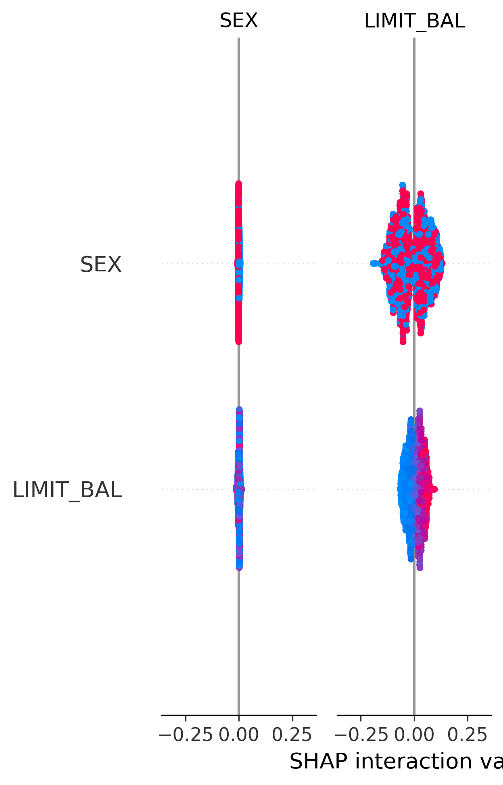
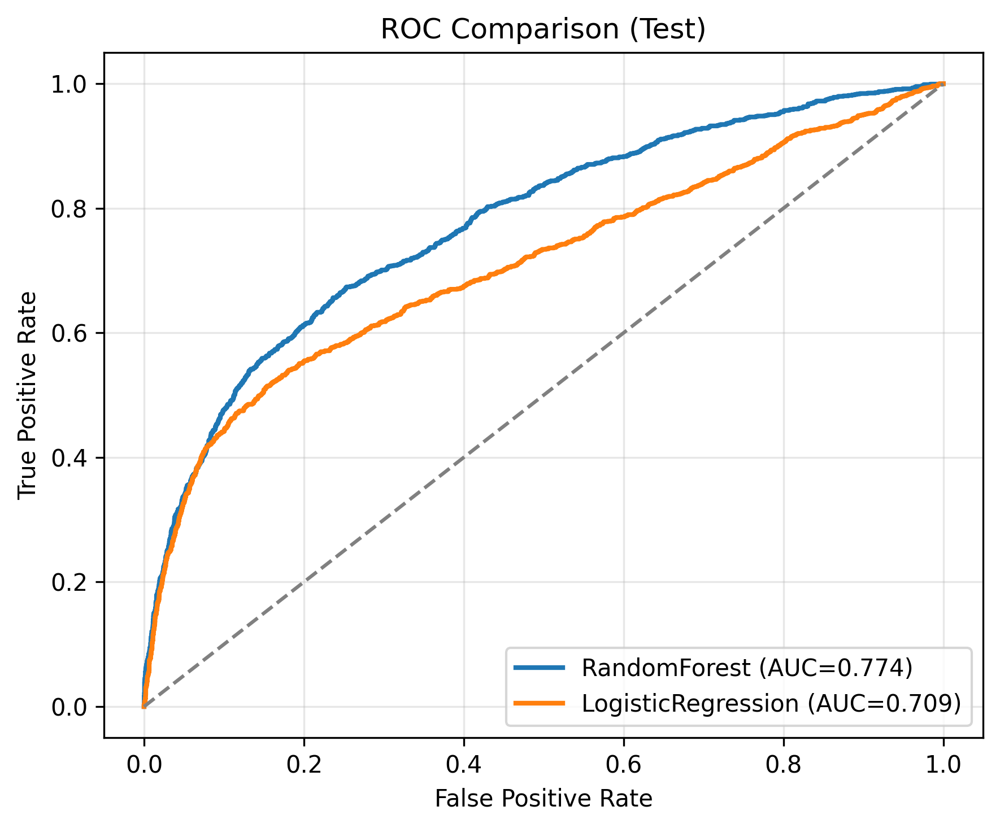
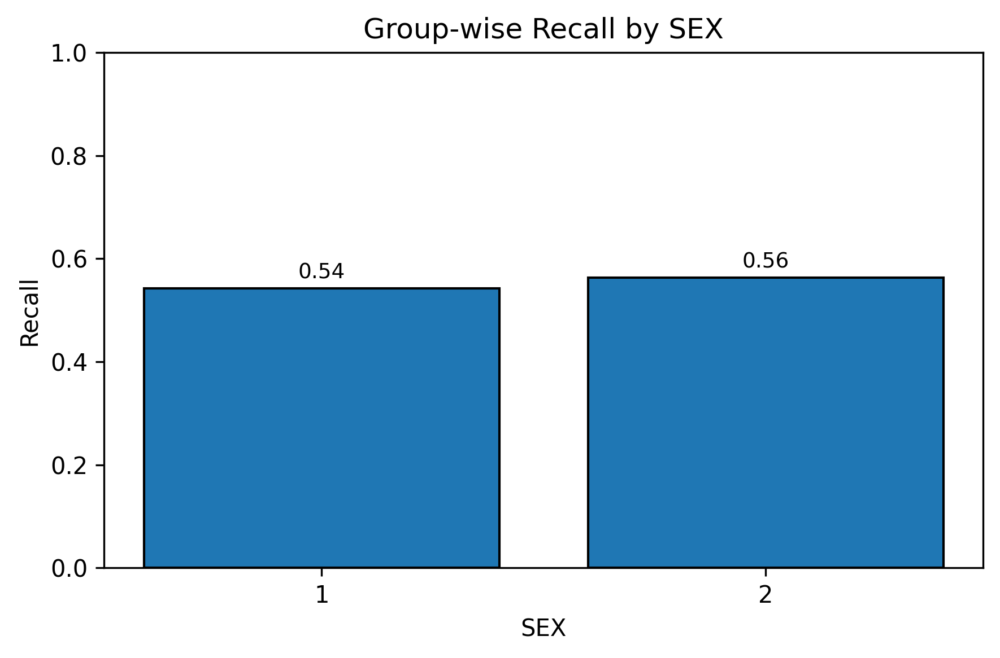

# Explainable AI (XAI) in Loan Decisioning

Turning a "black-box" credit-approval model into one that explains *why* an applicant was approved or rejected — using SHAP and LIME to make every decision human-readable, auditable, and fair.

## Why this project exists

AI models can predict loan defaults accurately, but banks and lenders can't legally or ethically deploy a model that just outputs "reject" with no reason. In India, RBI's digital lending guidelines now require disclosure of the algorithmic systems used in credit decisions and documented human oversight — explainability isn't optional anymore, it's a compliance requirement. This project builds a credit-risk model and wraps it in two industry-standard explainability layers so every prediction comes with a clear, traceable reason.

## What the model predicts

Given an applicant's financial profile, the model predicts the probability they will **default on their next payment** (binary classification: default / no default). Input features include:

- **Credit profile:** credit limit balance (`LIMIT_BAL`)
- **Demographics:** sex, education level, marital status, age
- **Repayment history:** 6 months of payment status (`PAY_0`–`PAY_6`)
- **Billing history:** 6 months of bill amounts (`BILL_AMT1`–`BILL_AMT6`)
- **Payment history:** 6 months of amounts actually paid (`PAY_AMT1`–`PAY_AMT6`)

## Pipeline

1. **EDA** — distribution plots, correlation heatmap, missingness check
2. **Baseline model** — Logistic Regression (interpretable baseline)
3. **Random Forest** — trained and compared against the baseline
4. **Hyperparameter tuning** — GridSearchCV on the Random Forest, selected as the final model
5. **Global explainability** — SHAP beeswarm + bar plots (which features matter most, across all predictions), permutation importance as a cross-check
6. **Local explainability** — SHAP waterfall plots *and* LIME explanations for individual cases: one true positive, one false positive, one false negative — showing how the model reasons on both correct and incorrect predictions
7. **Partial dependence (PDP) & individual conditional expectation (ICE) plots** — how the top two features (`PAY_0`, `LIMIT_BAL`) individually drive predicted risk
8. **Fairness audit** — model performance broken out by sex and education group, to check the model isn't systematically worse for any demographic
9. **Calibration check** — do predicted probabilities actually match real-world outcome rates
10. **Model comparison** — ROC/PR curves and confusion matrices, Logistic Regression vs. Random Forest

## Results (final model: tuned Random Forest, test set)

| Metric | Score |
|---|---|
| ROC-AUC | **0.774** |
| Accuracy | 78.9% |
| Default-class precision | 0.52 |
| Default-class recall | 0.55 |
| Default-class F1 | 0.54 |

The Random Forest clearly outperformed the Logistic Regression baseline (ROC-AUC 0.774 vs. 0.709), while SHAP/LIME kept it interpretable — so the accuracy gain didn't come at the cost of explainability.

**Top drivers of predicted default risk** (SHAP + permutation importance agree): most recent repayment status (`PAY_0`), repayment status two months prior (`PAY_2`), and credit limit (`LIMIT_BAL`) — consistent with real-world credit risk intuition, which is itself a useful sanity check on the model.


*SHAP beeswarm plot — each dot is one applicant. Red = high feature value, blue = low. `PAY_0` and `PAY_2` clearly dominate.*


*Random Forest (final model) vs. Logistic Regression baseline — the tuned RF consistently separates defaulters from non-defaulters better across all thresholds.*

**Fairness check:** recall was 54.2% for one sex group vs. 56.3% for the other — a modest, not alarming, gap. By education level, performance was more mixed across small subgroups (some groups had very few samples), a limitation worth flagging rather than hiding — exactly the kind of finding this fairness-audit step exists to surface.


*Fairness audit: model recall compared across demographic subgroups, part of the compliance-oriented evaluation this project focuses on.*

## Tech stack

`scikit-learn` (models, GridSearchCV, calibration, PDP/ICE) · `SHAP` (global + local explainability) · `LIME` (local explainability) · `pandas` / `numpy` (data handling) · `matplotlib` / `seaborn` (visualization) · `umap-learn` (embedding visualization) · `imbalanced-learn` (class imbalance handling)

## Repo structure

```
├── xai_loan_decisioning.ipynb   # full pipeline, step by step
├── artifacts/                   # trained models, metrics, SHAP values, fairness reports
├── viz/                         # every plot generated (SHAP, ROC/PR, fairness, calibration, etc.)
├── data/                        # raw + processed dataset
├── feature_info.md              # feature definitions
├── DATA_README.md               # dataset source & integrity checksum
└── requirements_xai.txt         # exact package versions
```

## How to run

```bash
pip install -r requirements_xai.txt
jupyter notebook xai_loan_decisioning.ipynb
```

## Limitations & next steps

- Default-class recall (~55%) has room to improve — likely next step is testing SMOTE/class-weighting more aggressively given the class imbalance (default cases are ~22% of the dataset)
- Fairness audit by education was inconclusive for smaller subgroups due to low sample sizes — would need a larger or rebalanced dataset to draw firm conclusions there
- Next iteration: wrap the tuned model + SHAP explainer in a simple API/Streamlit interface so a non-technical loan officer could query "why was this applicant rejected?" in plain language
